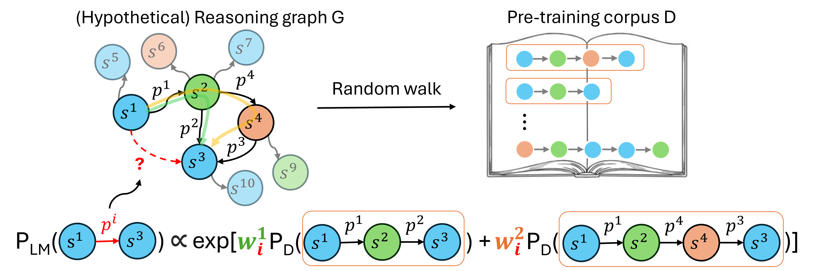

# Understanding the Reasoning Ability of Language Models From the Perspective of Reasoning Paths Aggregation



This is the official reposaitory for paper [Understanding the Reasoning Ability of Language Models From the Perspective of Reasoning Paths Aggregation](https://arxiv.org/abs/2402.03268). It is well-known that a pre-trained large language model (LLM) is able to do complex reasoning without any fine-tuning. In this work, we hypothesize that an LLM is able to draw novel conclusions between two concepts by aggregating the reasoning paths between them in the pre-training data. To investigate this hypothesis, we study two important case of reasoning in details: **logical reasoning** and **math reasoning**. 

For **logical reasoning**, we consider the classical setting of knowledge graph reasoning for its contrability. Please see `./kg_reasoning` for implementation details.

For **math reasoning**, we further confirm the important role of (random walk) reasoning paths in pre-training data, by show improved chain-of-thought (CoT) reasoning performance with random-walk-augmented data. Please see `./cot_reasoning` for implementation details.

## Citation

* To cite our paper:
    ```
    @article{wang2024understanding,
    title={Understanding the Reasoning Ability of Language Models From the Perspective of Reasoning Paths Aggregation},
    author={Wang, Xinyi and Amayuelas, Alfonso and Zhang, Kexun and Pan, Liangming and Chen, Wenhu and Wang, William Yang},
    journal={arXiv preprint arXiv:2402.03268},
    year={2024}
    }
    ```