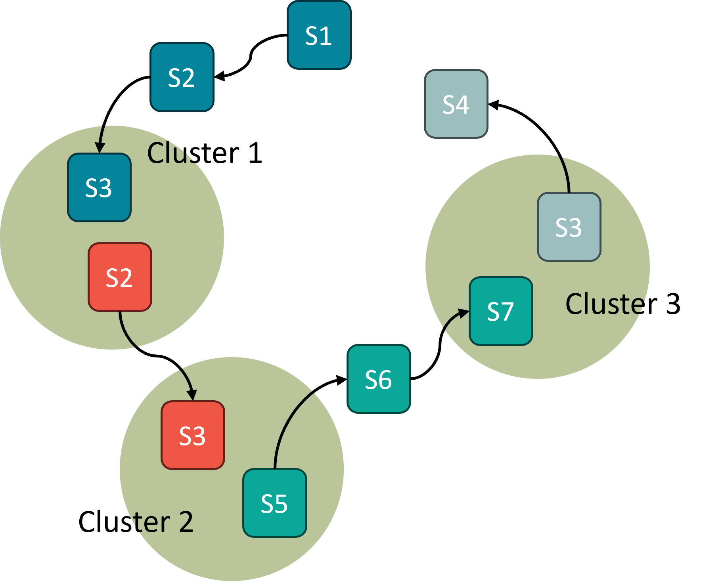

# Large Language Models Learn Chain-of-Though Reasoning From Random Walk Reasoning Paths

We extract a reasoning graph from the CoT solutions in training sets of math world problems, and then generate unlabeled augmented random walk reasoning paths from the reasoning graph. We then continue pre-train an LLM on the augmented random walk paths, and show performance improvement across three math world problem datasets with various size models. This show that the latent reasoning graph assumption is a reasonable way to understand how language model learn the reasoning structure from pre-training.



## Usage

All data and models can be loaded from Huggingface. A huggingface Hub token is required to use the Llama family models. To set up the environment, run
```
pip install -r requirements.txt 
```
We use python 3.9 for all experiments. A model name map in `model/utils.py` has been created to simplify the model name/path. Please see/modify the predifined model names there.

### Reasoning graph node inference

There are node inference models in `./data`. See subfolders for corresponding embedding model names. If you want to train your own model, the `cluster.sh` script can be used for training a node inference model from the embedded training data. The checkpoints will be saved in `./load_data/extract_steps`. 

Key arguments:

* `--dataset`: Possible choices of datasets: `gsm8k`, `svamp`, `aqua`. Note that `aqua` is significantly larger than the other two datasets.

* `--model_name_or_path`: Embedding model name/path. 

* `--batch_size`: Only affect embedding computation.

* `--num_types`: number of nodes.

### Continue pre-training

The `./train_random_walk.sh` script can be used for (parameter efficient) contine pre-train a pre-trained language model with augmented random walk data. If performing parameter efficient fine-tuning, only the adapters will be saved in the checkpoint in `./checkpoints`.

Key arguments:

* `--dataset`: Same as `--dataset` in `./cluster.sh`.

* `--model_name_or_path`: Base model name/path.

* `--parameter_efficient_mode`: Whether to perform parameter efficient fine-tuning. `none` means full fine-tuning. `lora` means LORA fine-tuning. `prompt-tuning` means tuning the embeddings of newly added tokens. To use planning tokens with LORA fine-tuning, this argument needs to be set as `lora+prompt-tuning`. The parameter efficient fine-tuning alghorithms are implemented based on the [PEFT](https://github.com/huggingface/peft) library. 

* `--num_nodes`: same as `--num_types` in `./cluster.sh`.

* `--model_max_length`: We set this to 512 for `gsm8k` and `svamp`, and 1024 for `aqua`.

* `--int8_training`: Turn on this flag to save more GPU memories. Might impact the model performance.

### Chain-of-thoughts fine-tuning

The `./fine-tune.sh` script can be used for (parameter efficient) fine-tuning a pre-trained language model with CoT data. The accuracy evaluation has been built in the training loop. If performing parameter efficient fine-tuning, only the adapters and the newly added token embeddings will be saved in the checkpoint in `./checkpoints`.

Key arguments:

* `--model_name_or_path`: Model name/path. For our proposed method, this must be the path to a checkpoint produced by the continue pre-training step.

* `--base_model_name_or_path`: Base model for paramter efficient fine-tuning checkpoints. Must be the same as the `--model_name_or_path` in `./train_random_walk.sh` to correctly load the checkpoints.

* `--num_test`: The maximum number of testing examples to be evaluated at the end of each epoch. We set this to 1000.

* Other arguments are the same as the previous continue pre-training step. Please make sure that they match the value in the `./train_random_walk.sh` script producing the continue pre-training checkpoint.

### Evaluation

In the paper, we report the epoch producing the highest eval accuracy. The accuracy evaluation has been built in the training loop, and can be checked in the `trainer_state.json` file saved in the checkpoints as `eval_acc`.

To do evaluation sparately and save the generation results, use the script `eval.sh`. The model generation results will be saved in the same directory as the loaded checkpoint. The saving format would be question - empty line - generated solution - empty line - ground truth solution.

Key arguments:

* `--model_name_or_path`: Checkpoint path. 

* `--base_model_name_or_path`: Base model for paramter efficient fine-tuning checkpoints. Must be the same as the `--model_name_or_path` or `--base_model_name_or_path` in `./fine-tune.sh` to correctly load the checkpoints.

* Please follow `./fine-tune.sh` for other arguments.