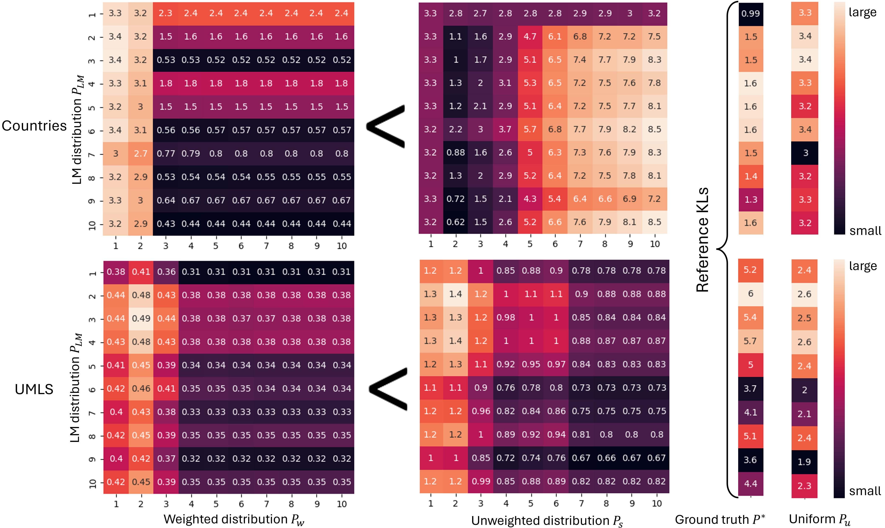

# Investigating large language models' reasoning mechanism with knowledge graph reasoning

We pre-train a small Transformer from scratch using the next-token-prediction object on random walk paths sampled from a knowledge graph. We compare the resulting language model distribution with the output distribution of a classical knowledge graph reasoning algorithm, path ranking algorithm (PRA), which predict unseen triples by a logical-rule-aware weighted sum of the random walk paths probabilities. The KL divergence between them can be illustrated in the heatmaps below:



## Usage

To set up the environment, run
```
pip install -r requirements.txt 
```
We use python 3.9 for all experiments.

### Training

To pre-train a (small) Transformer from scratch on random walk paths sampled from a knowledge graph, run the script `train.sh`. 

Key arguments:

* `--dataset`: Specify a dataset among: `countries_S3`, `FB15K-237`, `kinship`. `nell-995`, and `umls`.

*  `--model_name_or_path`: Specify the Transformer config by Huggingface name or local checkpoints. In the paper, we use the same config as `gpt2` from Huggingface. 

* `--max_steps`: The number of training steps. 

* `--path_len`: Maximum random walk path length for training the language model.

### Evaluation

To evaluate the pre-trained model testing accuracy, run the script `eval.sh`. 

Key arguments:

* `--model_name_or_path`: Checkpoint path. 

* `--dataset`: Specify a dataset among: `countries_S3`, `FB15K-237`, `kinship`. `nell-995`, and `umls`. Must be consistent with the checkpoint training data.

* `--split`: Data split. Can be `dev` or `test`. `dev` is usually simpler than `test`. In the paper, we report `test` accuracy.

* `--output_dir`: Without specifying this argument, the evaluation output will be saved under the same directory as the model weights.

### Analysis

To produce a heatmap as shown above and obtain KL divergence related informantion, run the script `heatmap.sh`.

Key arguments:

* `--pra_temp`: Temperature for computing weighted (PRA) and unweighted aggregation distribution as shown in Equation (3) and (4) in the paper, respectively.

* `--restricted_vocab`: The distribution space. Default to `all_entities`. `core_entities` is a smaller set of entities that has been seen with the goal relation, which will speed up the PRA inference.

* `--max_rule_len`: Maximum random walk path length for computing the path aggregation distributions. Note that a longer length will significantly slow done the inference time.